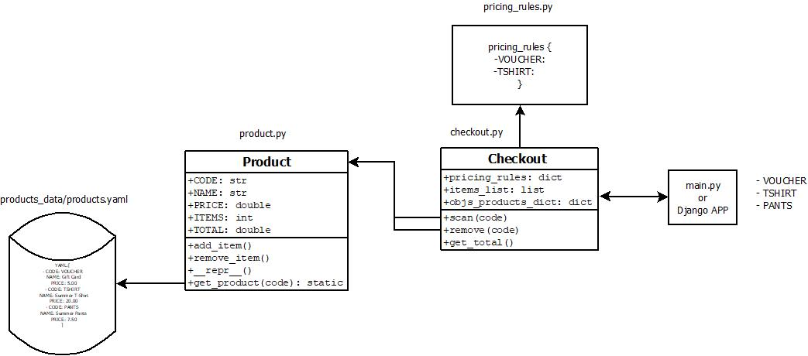

=======

# Introduction
This package simulates a store cash register. Its main functions are: to scan the elements of the products in the store and return the total cost and also the option to delete if we want to eliminate one or more of the elements that we have already scanned.
The three products of the store are the following:

1. CODE: VOUCHER, NAME: Gift Card, PRICE: 5.00€
2. CODE: TSHIRT, NAME: Summer T-Shirt, PRICE: 20.00€
3. CODE: PANTS, NAME: Summer Pants, PRICE: 7.50€

and The discounts applied are:

1. A 2-for-1 special on VOUCHER items.
2. If you buy 3 or more TSHIRT items, the price per unit should be 19.00€.

# Package Module



# Getting Started

##	Installation process
For installation run the following command:

```bash
    python -m pip install git+https://github.com/rabaixo/cashRegister.git
```

## Software dependencies
The requirements.txt file contains the necessary dependencies for the correct work of the packages, which are installed once the package is installed.
Dependencies:

1.	jmespath
2.	pytest

## How to run
To launch the package you must execute the following command:

```bash
    scan_clothes -p [PRODUCTS_LIST]
```

For example:

```bash
    scan_clothes -p TSHIRT TSHIRT TSHIRT VOUCHER TSHIRT
```

The displayed result should be:

    Items: TSHIRT - Total:20.0
    Items: TSHIRT, TSHIRT - Total:40.0
    Items: TSHIRT, TSHIRT, TSHIRT - Total:57.0
    Items: TSHIRT, TSHIRT, TSHIRT, VOUCHER - Total:62.0
    Items: TSHIRT, TSHIRT, TSHIRT, VOUCHER, TSHIRT - Total:81.0

The elements are scanned one by one.

For more information about the execute command, launch:

```bash
    scan_clothes -h
```

To see the package working on a django application, access the following link:

- [http://rabaixon.pythonanywhere.com/](http://rabaixon.pythonanywhere.com/)


#  Test
Four unit tests are carried out to verify the correct functioning of the functionalities of the package.

1. The correct behavior of price rules when scanning items.
2. An error should be returned when trying to scan an element with non-existent code in the database.
3. When a product is deleted from the list of items, the list and the value of the total cost must be updated.
4. A warning should be returned when trying to delete an unregistered element (for Django web app).

To launch the test, go to the package and execute the following command:

```bash
    python3 -m pytest test/test.py -v
```

